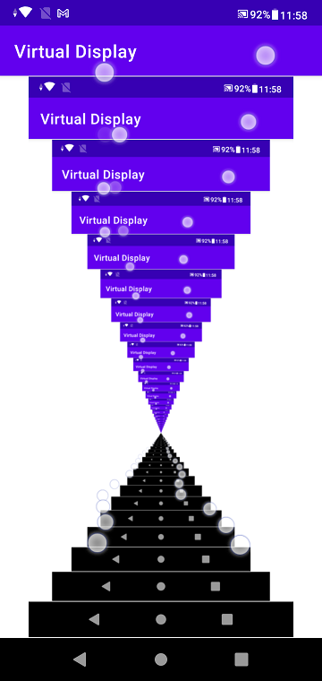

# VirtualDisplay sample

## Step 1.
VirtualDisplay -> SurfaceView.getHolder().getSurface()

## Step 2.
VirtualDisplay -> ImageReader.getSurface() -> ImageView

from "Empty Activity" by Andorid Studio 4.2.1

## confirmed
HTC HTL23 (Android 5.0.2)

Samsung Galaxy S7 edge (Andorid 7.0)

ASUS_X01AD(Android 9)

## article
https://www.remix.asia/blog/remix/2020/12/virtualdisplay.html